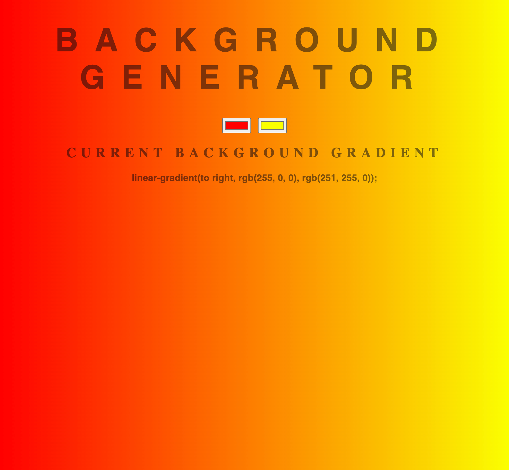

# Background Generator

## Description

This dynamic webpage allows users to play around with different background gradients and select their preference. 

## Installation

N/A

## Usage

To use this webpage, click on the color input and drag the color picker to select the color of your choice. A combination of the two colors gives the color gradient. The CSS code for the gradient is displayed right below the color inputs.

The following image shows the web application's appearance and functionality:

## Credits

ZTM Academy

## License

MIT

## Deployment  
Here is the link to the webpage:

[Background Generator](https://wdverse.github.io/background-generator/)